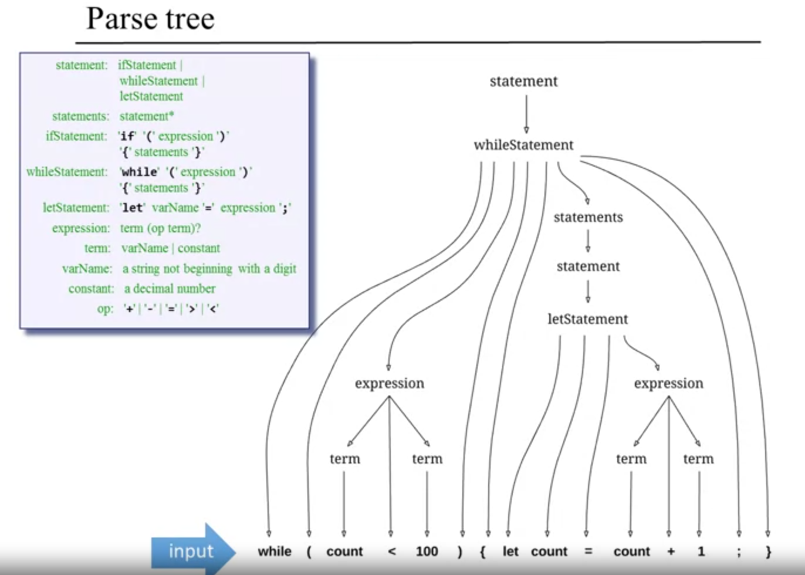

# PersonalComputer
- ALU/CPU design and implementation using elementary logic gates and flip flops in HDLWriting
- Assembler , VMTranslator and Compiler to parse Java like high level language responsible
  for converting bytecode to machine-specific code

- Understanding Object-based design and programming, abstract data types, scoping rules, syntax and semantics, references

## The HACK Computer

### THE ISA

## The JACK Compiler

### Memory Segements

### Function Implementation

### The JACK Tokenizer

### Compiling Epxressions

### Crafting the Compiler

http://www.craftinginterpreters.com/contents.html

#### Symbol Tables

### Objetct Construction 

1. A constructor allocates memory for the object on the memory heap based on the number of fields and returns the reference to the start of memory segment allocated fot this object
2. For further calls we use the **this** pointer(containing the memory address of start of class) to access the variables stored for that class 

Array Implementation

- We use the **that** pointer for this approach , it stores the address of the location from which we want to read/write the data  
- We push the data at that = arr+expression1  

### The OS

Heap Management

The Big Picture

**Exposure: Computer Architecture , Machine Language , Compiler Design , Operating System**
